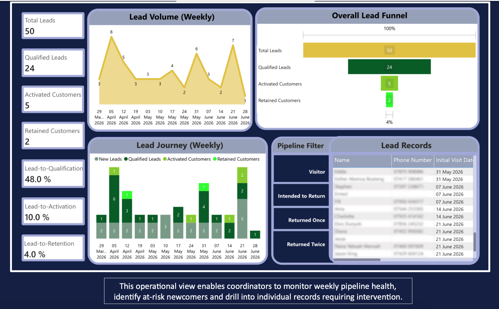
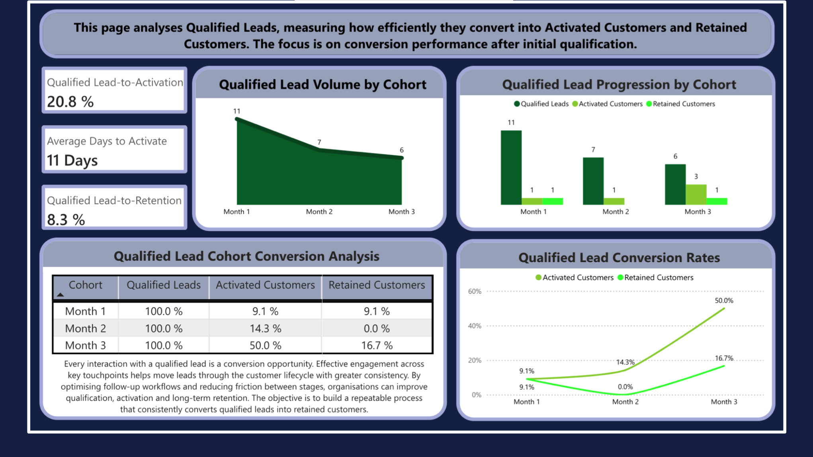
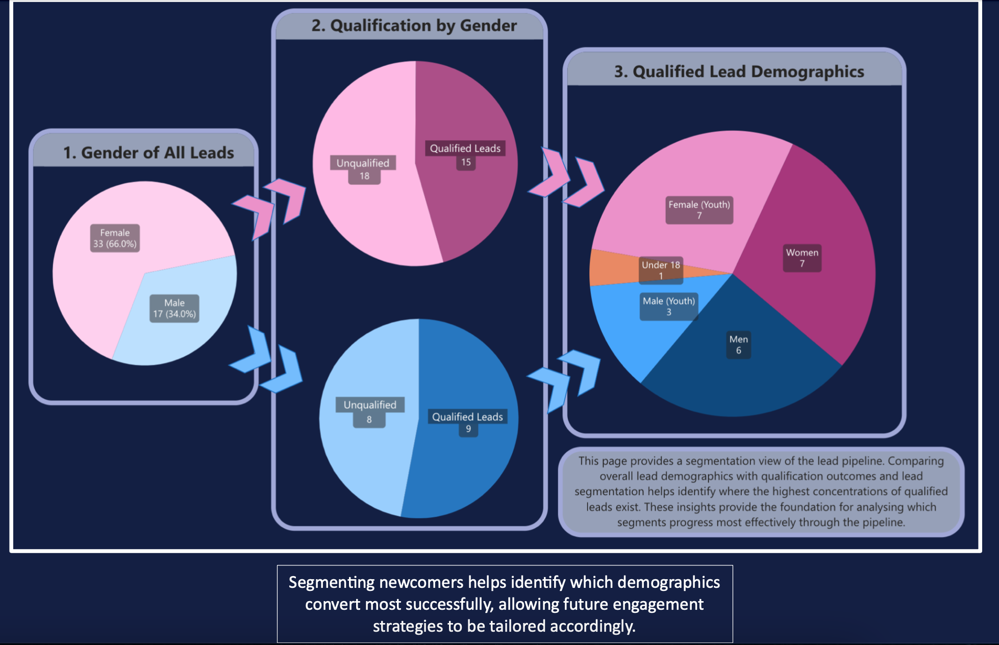

# Operations Analytics Portfolio

Welcome to my Operations Analytics portfolio.

This repository showcases projects demonstrating CRM analytics, operational reporting, KPI design, Power BI dashboards, process improvement and data-driven decision making.

---

# Featured Project

## Customer Journey & Retention Dashboard

This project demonstrates how operational analytics can improve customer retention through KPI design, customer journey analysis, dashboard development and executive reporting.

### Skills Demonstrated

- Power BI
- CRM Analytics
- KPI Design
- Dashboard Development
- Process Improvement
- Data Visualisation
- Stakeholder Reporting
- Operations Strategy

---

### Project Files

📄 Operations Analytics Case Study.pdf

---

*All data has been anonymised for portfolio purposes.*

# Operations Analytics Case Study
### Power BI • Revenue Operations • Customer Journey Analytics • Process Improvement

---

## Project Overview

This project demonstrates how operational analytics can be used to improve customer acquisition, activation and long-term retention by identifying bottlenecks throughout the customer journey.

The objective was to replace manual reporting with KPI-driven decision making by designing a Power BI dashboard that tracks customers through each stage of the operational pipeline, measures conversion performance, and highlights opportunities for process improvement.

Although this project uses anonymised customer data, the analytical methodology reflects the same principles used in Sales Operations, Revenue Operations and Business Intelligence environments.

---

# Executive Dashboard

The Executive Dashboard provides leadership with a high-level operational overview of the entire customer pipeline.

It enables decision makers to monitor overall performance through a combination of KPIs, trend analysis and pipeline reporting.

### Key Metrics

- Total Leads
- Qualified Leads
- Activated Customers
- Retained Customers
- Weekly Lead Volume
- Overall Funnel Performance
- Pipeline Conversion Rates
- Individual Lead Records

### Operational Value

This dashboard enables leadership to quickly assess pipeline health, monitor conversion performance and identify areas requiring operational intervention.

 

---

# Conversion Analysis

The Conversion Analysis dashboard measures how efficiently qualified leads progress through the customer lifecycle after qualification.

Rather than simply reporting totals, the dashboard focuses on measuring operational efficiency throughout the conversion process.

### Key Metrics

- Qualified Lead-to-Activation Rate
- Qualified Lead-to-Retention Rate
- Average Days to Activation
- Monthly Cohort Performance
- Conversion Rate Trends

### Operational Value

Monitoring conversion performance highlights where friction exists within the customer journey and helps identify opportunities to improve activation, retention and overall operational efficiency.

---

# Lead Segmentation

The Lead Segmentation dashboard analyses the demographic composition of the lead pipeline and compares overall lead distribution with qualification outcomes.

Segmenting leads provides additional context behind conversion performance and supports more targeted engagement strategies.

### Key Analysis

- Overall Lead Demographics
- Qualification by Gender
- Qualified Lead Demographics

### Operational Value

Understanding which customer segments qualify most successfully enables engagement strategies to become more targeted and data-driven.

---

# Segment Performance

The Segment Performance dashboard evaluates how different qualified lead segments perform after entering the operational pipeline.

Rather than treating every lead equally, the dashboard measures activation performance across customer segments to identify where engagement strategies are working most effectively.

### Key Analysis

- Qualified Lead Demographics
- Activated Customer Segments
- Activation Rates by Segment

### Operational Value

Comparing activation performance across customer segments helps identify where follow-up processes are effective and where additional workflow optimisation may improve conversion outcomes.

---

# Skills Demonstrated

- Power BI Dashboard Development
- KPI Design & Performance Measurement
- Revenue Operations Reporting
- Customer Journey Analytics
- Funnel Analysis
- Cohort Analysis
- Lead Segmentation
- Conversion Analysis
- Executive Reporting
- Data Visualisation
- Process Improvement
- Business Analytics
- DAX Measures
- Data Modelling
- Data Storytelling

---

# Tools Used

- Power BI
- Microsoft Excel
- DAX
- Power Query
- Data Modelling

---

# Key Outcomes

- Designed an end-to-end operational reporting solution.
- Built executive dashboards to support data-driven decision making.
- Developed KPI frameworks to monitor customer progression through the operational pipeline.
- Applied customer journey analytics to identify conversion bottlenecks.
- Demonstrated how operational reporting can support continuous process improvement.

---

# About this Project

This project was independently designed and developed as part of my Operations Analytics portfolio.

The dashboard demonstrates my approach to using data to improve operational performance, support strategic decision-making and build scalable reporting solutions relevant to Revenue Operations, Sales Operations and Business Intelligence roles.
